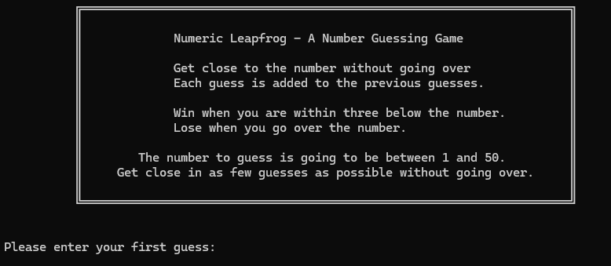

# NumericLeapfrog

Just a simple game where you need to guess a mystery number where the guess is a cumulative number which means any new guess is added on top of the existing guess. Try to guess the number in as few guesses as possible. No prizes, sorry.

I've tried to keep it all very readable so the title box is abstracted away in the code.

I've added a little Spinner class to make it look like there is some more serious processing going on. 

Some of the code is written in a functional way to keep it concise and to the point.
